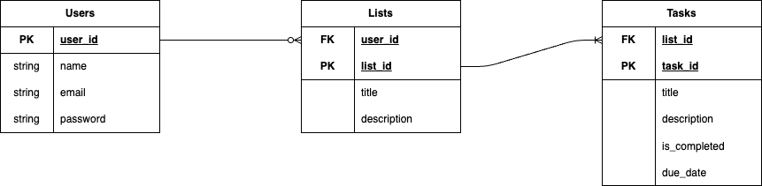

# Lê Trung Hiếu - 22010482

## Mục lục

- [Giới thiệu](#giới-thiệu)
- [Sơ đồ cấu trúc](#sơ-đồ-cấu-trúc)
- [Sơ đồ thuật toán](#sơ-đồ-thuật-toán)
- [Giao diện thực tế](#giao-diện-thực-tế)
- [Code minh học](#code-minh-học)
- [Link Repo](#link-repo)
- [Link Deploy](#link-deploy)

## Giới thiệu

Dự án To-do App được xây dựng nhằm mục tiêu giúp người dùng quản lý công việc cá nhân một cách hiệu quả và khoa học. Ứng dụng cho phép người dùng tạo, chỉnh sửa, xóa và đánh dấu hoàn thành các nhiệm vụ hàng ngày. Ngoài ra, hệ thống còn hỗ trợ phân loại công việc theo trạng thái, ưu tiên, giúp người dùng dễ dàng theo dõi tiến độ và sắp xếp công việc hợp lý.

Phạm vi của dự án bao gồm việc xây dựng một ứng dụng web sử dụng PHP và Laravel làm nền tảng backend, kết hợp với giao diện thân thiện, dễ sử dụng. Ứng dụng hướng đến việc cung cấp trải nghiệm mượt mà, bảo mật thông tin cá nhân và có khả năng mở rộng trong tương lai như tích hợp tính năng nhắc nhở, đồng bộ hóa đa thiết bị hoặc chia sẻ công việc với người khác. Dự án phù hợp cho cả cá nhân và nhóm nhỏ mong muốn tối ưu hóa quy trình làm việc hàng ngày.

## Sơ đồ cấu trúc

## Sơ đồ thuật toán

## Giao diện thực tế

## Code minh học

## Link Repo

## Link Deploy