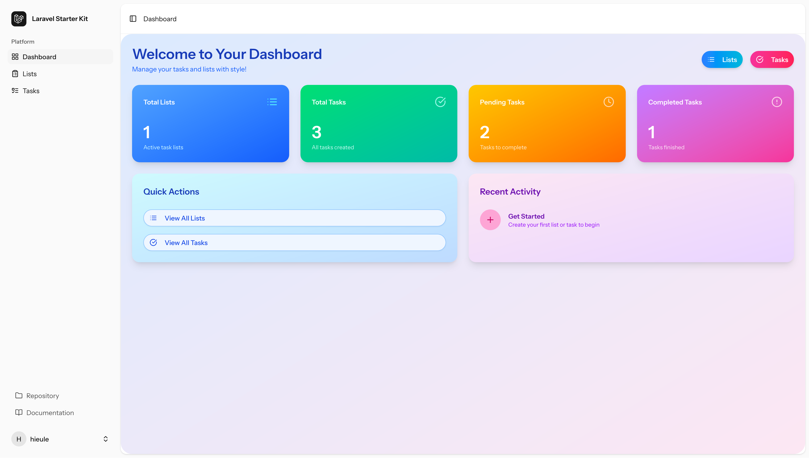
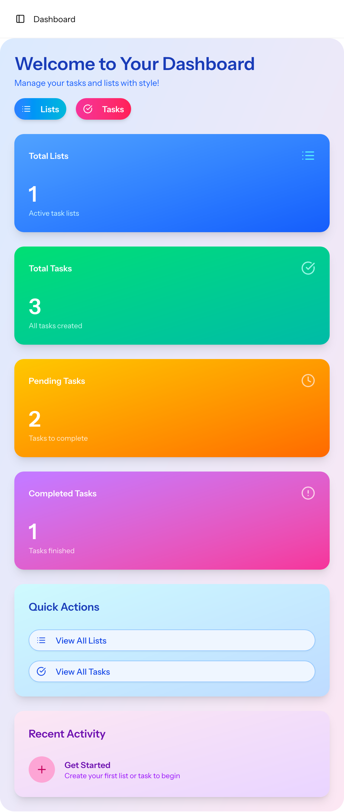
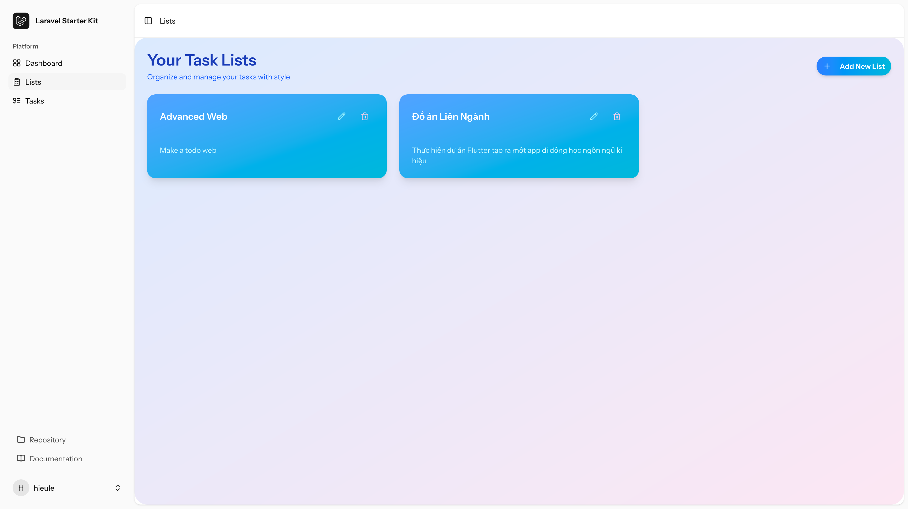
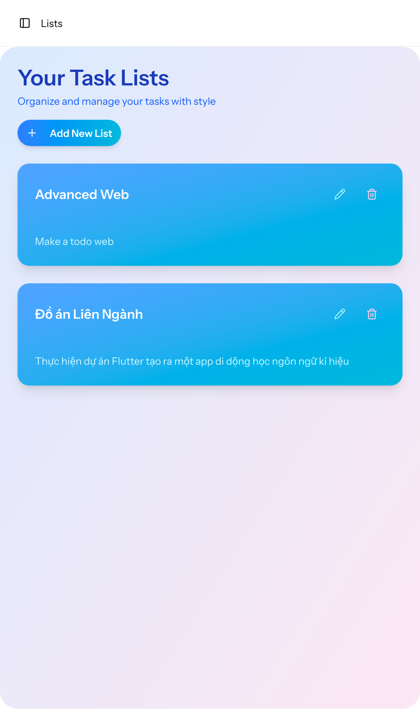
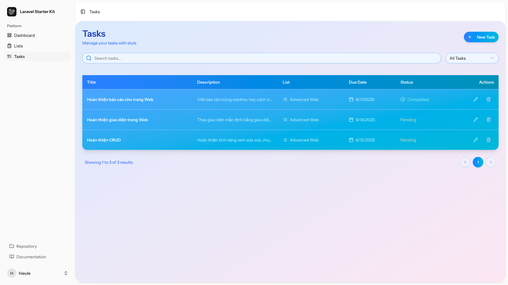
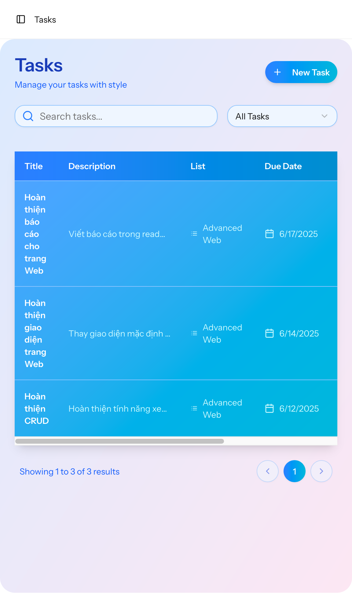
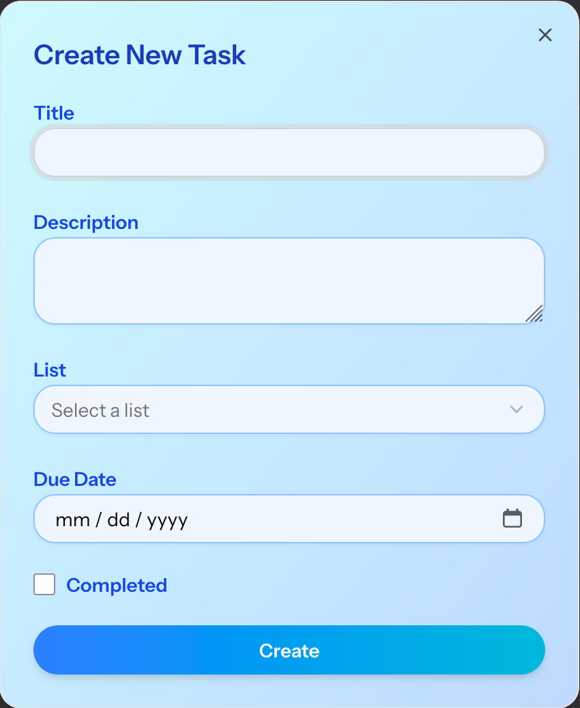

# Bài tập giữa kì: Thiết kế todo Web

# Họ và tên: Lê Trung Hiếu 

# Mã sinh viên: 22010482

## Mục lục

- [Giới thiệu](#giới-thiệu)
- [Sơ đồ cấu trúc](#sơ-đồ-cấu-trúc)
- [Sơ đồ thuật toán](#sơ-đồ-thuật-toán)
- [Giao diện thực tế](#giao-diện-thực-tế)
- [Code minh họa](#code-minh-họa)
- [Link Repo](#link-repo)
- [Link Deploy](#link-deploy)

## Giới thiệu

Dự án To-do App được xây dựng nhằm giúp người dùng quản lý công việc cá nhân một cách hiệu quả và khoa học. Ứng dụng cho phép tạo, chỉnh sửa, xóa và đánh dấu hoàn thành các nhiệm vụ hàng ngày. Ngoài ra, hệ thống hỗ trợ phân loại công việc theo trạng thái, ưu tiên, giúp người dùng dễ dàng theo dõi tiến độ và sắp xếp công việc hợp lý.

Phạm vi dự án bao gồm xây dựng một ứng dụng web sử dụng PHP và Laravel cho backend, kết hợp với giao diện thân thiện, dễ sử dụng. Ứng dụng hướng đến trải nghiệm mượt mà, bảo mật thông tin cá nhân và có khả năng mở rộng trong tương lai như tích hợp nhắc nhở, đồng bộ hóa đa thiết bị hoặc chia sẻ công việc với người khác. Dự án phù hợp cho cá nhân và nhóm nhỏ mong muốn tối ưu hóa quy trình làm việc hàng ngày.

## Sơ đồ cấu trúc


### Mô tả sơ đồ cơ sở dữ liệu

Dự án sử dụng cơ sở dữ liệu quan hệ gồm ba bảng chính: **Users** (Người dùng), **Lists** (Danh sách), và **Tasks** (Nhiệm vụ). Các bảng liên kết với nhau qua khóa chính (PK) và khóa ngoại (FK).

#### **Bảng Users**
- **Khóa chính:** `user_id` (string)
- **Các trường:** 
    - `name` (string)
    - `email` (string)
    - `password` (string)
- **Mô tả:** Lưu trữ thông tin người dùng như tên, email và mật khẩu.

#### **Bảng Lists**
- **Khóa chính:** `list_id`
- **Khóa ngoại:** `user_id` (tham chiếu đến `user_id` trong bảng Users)
- **Các trường:** 
    - `title` (string)
    - `description` (string)
- **Mô tả:** Lưu trữ các danh sách công việc của từng người dùng, liên kết với bảng Users qua `user_id`.

#### **Bảng Tasks**
- **Khóa chính:** `task_id`
- **Khóa ngoại:** `list_id` (tham chiếu đến `list_id` trong bảng Lists)
- **Các trường:** 
    - `title` (string)
    - `description` (string)
    - `is_completed` (boolean)
    - `due_date` (date)
- **Mô tả:** Lưu trữ các nhiệm vụ cụ thể trong từng danh sách, bao gồm tiêu đề, mô tả, trạng thái hoàn thành và ngày đến hạn.

#### **Quan hệ giữa các bảng**
- Một người dùng (**Users**) có thể sở hữu nhiều danh sách (**Lists**) thông qua `user_id`.
- Một danh sách (**Lists**) có thể chứa nhiều nhiệm vụ (**Tasks**) thông qua `list_id`.

## Sơ đồ thuật toán

### Thuật toán thống kê dữ liệu tổng quan
<p align="start">
    
</p>

#### Sơ đồ hoạt động: Lấy Dữ liệu cho Trang Chủ

```mermaid
flowchart TD
    A[Bắt đầu] --> B{Người dùng đã đăng nhập?}
    B -- Không --> C[Chuyển hướng đến trang đăng nhập]
    B -- Có --> D[Lấy thông tin người dùng hiện tại]
    D --> E[Lấy danh sách (Lists) thuộc về người dùng]
    E --> F[Lấy nhiệm vụ (Tasks) thuộc về các danh sách]
    F --> G[Tính toán thống kê (Stats)]
    G --> H[Chuẩn bị dữ liệu để render]
    H --> I[Render trang chủ với Inertia]
    I --> J[Kết thúc]
```

**Chi tiết các bước:**

1. **Bắt đầu:**  
   Hệ thống khởi động chức năng `index` trong `DashboardController`.

2. **Kiểm tra người dùng đã đăng nhập:**  
   - Lấy thông tin người dùng hiện tại bằng `auth()->user()`.
   - Nếu không có người dùng, chuyển hướng đến trang đăng nhập (`redirect()->route('login')`).
   - Nếu có người dùng, tiếp tục quá trình.

3. **Lấy danh sách (Lists):**  
   Thực hiện truy vấn `TaskList::where('user_id', $user->id)->get()` để lấy tất cả danh sách thuộc về người dùng hiện tại.

4. **Lấy nhiệm vụ (Tasks):**  
   Thực hiện truy vấn `Task::whereHas('list', function ($query) use ($user) {...})->get()` để lấy tất cả nhiệm vụ thuộc về các danh sách của người dùng hiện tại.

5. **Tính toán thống kê (Stats):**  
   Tạo mảng `$stats` với các giá trị:
   - `totalLists`: Số lượng danh sách (`$lists->count()`).
   - `totalTasks`: Tổng số nhiệm vụ (`$tasks->count()`).
   - `completedTasks`: Số nhiệm vụ đã hoàn thành (`$tasks->where('is_completed', true)->count()`).
   - `pendingTasks`: Số nhiệm vụ chưa hoàn thành (`$tasks->where('is_completed', false)->count()`).

6. **Chuẩn bị dữ liệu để render:**  
   Gộp các dữ liệu vào mảng để truyền cho giao diện:
   - `stats`: Mảng thống kê.
   - `lists`: Danh sách đã lấy.
   - `tasks`: Nhiệm vụ đã lấy.
   - `flash`: Thông báo thành công hoặc lỗi từ session (`session('success')`, `session('error')`).

7. **Render trang chủ:**  
   Sử dụng `Inertia::render('dashboard', [...])` để hiển thị trang dashboard với dữ liệu đã chuẩn bị.

8. **Kết thúc:**  
   Quá trình hoàn tất, trang dashboard được hiển thị cho người dùng.

### Thuật toán hiển thị danh sách Task

### Thuật toán hiển thị danh sách List

### Thuật toán thêm, sửa, xóa List

### Thuật toán thêm, sửa, xóa Task

## Giao diện thực tế

### Giao diện màn hình chính

<p align="start">
    
    
</p>

### Giao diện danh sách List
<p align="start">
    
    
</p>

### Giao diện danh sách Task
<p align="start">
    
    
</p>

### Giao diện thêm List
<p align="start">
    
</p>

### Giao diện thêm Task
<p align="start">
    
</p>

## Code minh họa

## Link Repo

- [https://github.com/hieule0208/To-do-app-Laravel](https://github.com/hieule0208/To-do-app-Laravel)

## Link Deploy

- [https://expert-cod-x5r74j7wx6ggfp977.github.dev/](https://expert-cod-x5r74j7wx6ggfp977.github.dev/)
